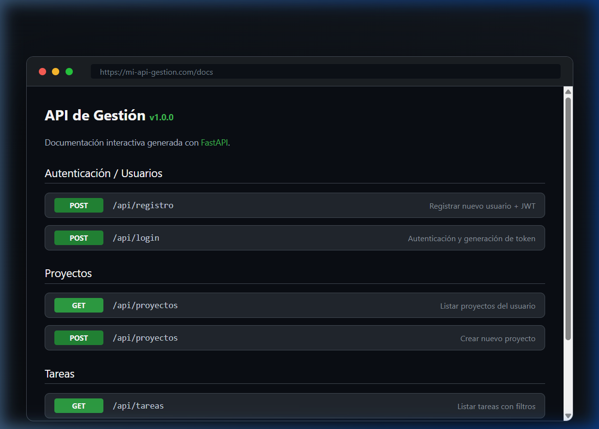
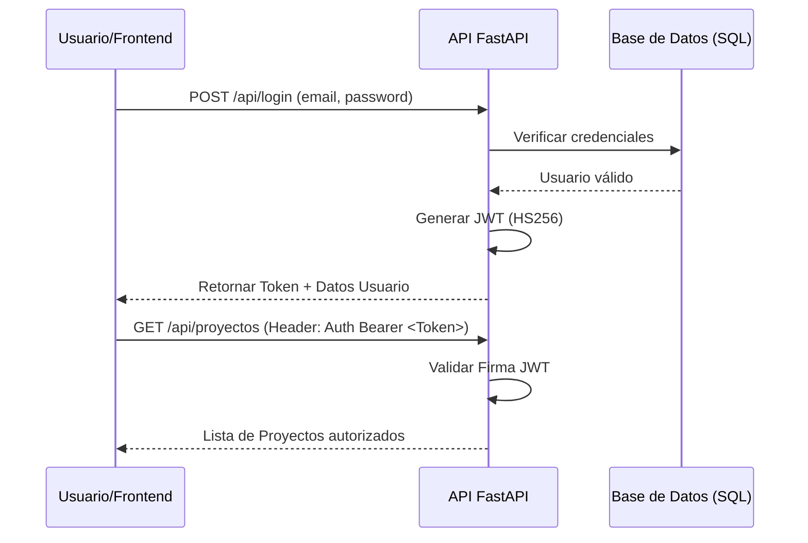

# 🚀 API de Gestión de Tareas y Proyectos



[](https://fastapi.tiangolo.com/)
[](https://jwt.io/)
[](https://www.sqlalchemy.org/)
[](https://www.docker.com/)

API REST robusta y escalable construida con **FastAPI**, diseñada para manejar la persistencia de datos de múltiples usuarios con un sistema de autenticación seguro basado en **Claims (JWT)**.

## 🌟 Showcase del Proyecto

Este no es solo un backend de ejemplo; es una base sólida para cualquier aplicación moderna:
*   **Seguridad:** Middleware de autenticación con `HTTPBearer`.
*   **Documentación Interactiva:** Swagger UI personalizado listo para pruebas inmediatas.
*   **Arquitectura Limpia:** Separación clara entre modelos, servicios y rutas (Patrón MVC).
*   **Dockerizado:** Lista para ser desplegada en entornos de producción con un solo comando.

## 🏗️ Flujo de Autenticación (JWT)



## ✨ Características Técnicas

| Módulo | Detalle Técnico | Beneficio |
|--------|-----------------|-----------|
| **Autenticación** | JWT con algoritmo HS256 | Sesiones sin estado (Stateless) y seguras. |
| **Persistencia** | SQLAlchemy + SQLite/Postgres | Flexibilidad total en el motor de DB. |
| **Validación** | Pydantic v2 | Tipado estricto y errores claros en tiempo real. |
| **Rendimiento** | Programación Asíncrona (Async/Await) | Capacidad para manejar miles de conexiones. |

## 🛠️ Stack Tecnológico

- **Framework:** FastAPI
- **ORM:** SQLAlchemy
- **Seguridad:** `python-jose` (JWT), `passlib` (bcrypt)
- **Servidor:** Uvicorn
- **Contenerización:** Docker & Docker Compose

## 🚀 Instalación y Ejecución

### Opción 1: Local (Recomendado para desarrollo)
```bash
# Entrar al directorio
cd api-gestion-fastapi

# Instalar dependencias
pip install -r requirements.txt

# Iniciar servidor
uvicorn app.main:app --reload
```

### Opción 2: Docker (Producción)
```bash
docker-compose up -d
```

Acceso a la documentación: `http://localhost:8000/docs`

## 📡 Endpoints Principales

| Categoría | Método | Endpoint | Acción |
|-----------|--------|----------|--------|
| **Auth** | `POST` | `/api/registro` | Registro de usuario |
| **Auth** | `POST` | `/api/login` | Login y obtención de JWT |
| **Proyectos**| `GET` | `/api/proyectos` | Listar mis proyectos |
| **Tareas** | `POST` | `/api/tareas` | Crear tarea vinculada |
| **Tareas** | `DELETE`| `/api/tareas/{tid}`| Borrado seguro por ID |

---

> [!IMPORTANT]
> **Enfoque en Seguridad:** Todas las rutas, excepto el registro y el login, están protegidas por el esquema de seguridad `HTTPBearer`, garantizando que solo los usuarios autenticados puedan acceder a sus propios recursos.